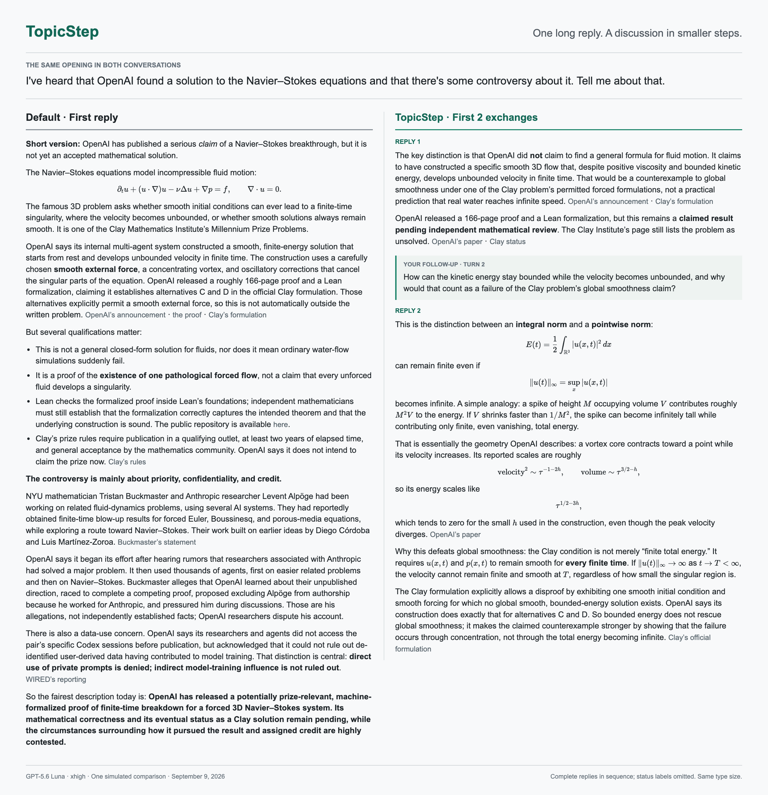

# TopicStep

Prepare the whole topic. Discuss it one understandable piece at a time.

TopicStep makes complex topics easier to discuss at a human pace. The assistant prepares the topic in a document, then explains smaller parts through lightweight, natural conversation, leaving you room to think and ask follow-up questions before moving on.



Same opening question: the default first reply on the left, the first two complete TopicStep exchanges on the right. Same font size and column width; status labels omitted. [View full-size image](examples/navier-stokes/comparison.png) or [read the complete comparison](examples/navier-stokes/README.md).

## Why TopicStep exists

### Models stream. People need time to think.

In their Neuron perspective, [Zheng and Meister argue that human behavioral information throughput is roughly 10 bits per second](https://doi.org/10.1016/j.neuron.2024.11.008). Meanwhile, OpenAI reports [more than 1,000 output tokens per second for Codex-Spark](https://openai.com/index/introducing-gpt-5-3-codex-spark/). Generating an explanation and making sense of it operate on very different timescales.

These are not directly interchangeable measures, and the paper does not test LLM conversations. The design question is simpler: when more text keeps arriving, are you getting room to think, or just trying to keep up? TopicStep separates the assistant's preparation from its conversational pace, so you can examine an idea before the next one arrives.

<details>
<summary>A rough bits-per-second illustration, not a cognitive speed comparison</summary>

Using [approximately 4 English characters per token](https://help.openai.com/en/articles/4936856) and the paper's rough estimate of 1 bit per English character gives:

`estimated text information rate = tokens/second x 4 characters/token x 1 bit/character`

| Assumed output rate | Illustrative text information rate |
| --- | ---: |
| 50 tokens/s | about 200 bits/s |
| 100 tokens/s | about 400 bits/s |
| 1,000 tokens/s | about 4,000 bits/s |

The first two rates are illustrative scenarios, not measured averages. The last uses a rounded rate from the Codex-Spark announcement, not a measurement of our example model. Actual rates vary by model, workload and serving conditions.

This applies an English-text entropy assumption; it does not measure the information content of actual LLM output or the mental effort required to understand it. Nor is 10 bits/s a universal reading limit: the [paper's table](https://arxiv.org/html/2408.10234v2) includes English reading estimates of 28-45 bits/s. Text redundancy, prior knowledge and opportunities to pause all matter. These numbers do not establish an overload threshold or prove that streaming prevents deep thought.

</details>

### Too much, all at once

An assistant can answer a complex question with an impressive wall of information. But receiving the whole explanation at once creates cognitive load: before you have understood the first idea, several more have already arrived. Keeping up with the answer can crowd out the deeper thinking you came for: examining an assumption, connecting an idea to something you know, or noticing what you still do not understand.

The experience should feel closer to an everyday conversation. Explain a small part, leave room to sit with it and ask a follow-up, then continue when you are ready. The aim is not merely shorter answers; it is control over when more information arrives, so you have space to think rather than simply keep reading.

### A pacing prompt is not durable discussion structure

"Let's discuss this step by step" is a useful start, but a single instruction offers little structure for sustaining that experience. Replies can become long again. As a discussion grows and its context is compacted, the original scope, useful research and unresolved questions can become less accessible, allowing the discussion to drift.

TopicStep adds two things: explicit conversational rules for gradual explanation, and an external dossier that preserves the original topic and its substance. The dossier gives the assistant something concrete to return to, instead of relying entirely on the surviving chat context.

These are the problems the skill is designed to address, not guarantees that every reply will be brief or every context transition flawless.

## How it works

1. Organize the topic and research it as needed. Write a bounded dossier before starting the explanation.
2. Begin with one foundational or high-leverage point, not a compressed overview of every branch.
3. Answer follow-ups naturally and completely, without dumping the remaining document into chat.
4. Consult the dossier when recovering context or developing material that is not already available. Update it for meaningful corrections or conclusions, not after every ordinary reply.

TopicStep is a discussion companion, not a teaching protocol or a general-purpose memory system. There are no required quizzes, comprehension tests, or questions you must answer before receiving a direct explanation. You can follow your curiosity, redirect the conversation, or explicitly ask for the whole overview.

The dossier preserves the topic: its concepts, evidence, conclusions, disagreements and open questions. It is not a learner profile or a per-turn learning log, and it does not store private chain-of-thought. Keeping it up to date is event-driven rather than routine bookkeeping, so the document supports the conversation without becoming another task to manage.

One active topic is maintained per session. Reinvoking the skill does not silently replace it. Ending a discussion is explicit.

## Example

See the [complete English comparison](examples/navier-stokes/README.md): a curious first-year mathematics student asks about an OpenAI Navier-Stokes announcement and the associated controversy.

The comparison includes default behavior, a simple step-by-step prompt, and TopicStep. No source pack or fixed follow-up sequence was supplied. Each simulated student stopped on its own.

In this single run, TopicStep's median reply was 315 word-like units, compared with 348 for the simple prompt and 644 for default behavior. It lasted more turns, so its total output was not the smallest. The example illustrates pacing differences; it does not establish general superiority or improved human learning.

One real compaction occurred in the TopicStep tutor. The discussion continued, but this was not a controlled recovery test and did not exercise the installed hooks. We cannot attribute that continuation to the dossier alone.

## Skill and adapters

### Install locally (Codex, macOS/Linux)

Requires Python 3.10+ and Git. These commands assume the destination paths do not already exist; keep or back up an existing installation instead of overwriting it.

```sh
mkdir -p "$HOME/.codex/skills" "$HOME/.agents/skills"
git clone https://github.com/Yjejuy/Topicstep.git "$HOME/.codex/skills/jj-discuss-step-by-step"
ln -s "$HOME/.codex/skills/jj-discuss-step-by-step" "$HOME/.agents/skills/jj-discuss-step-by-step"
```

The clone location matches this skill's helper commands; the symlink exposes it in Codex's documented user skill directory. Restart Codex if it does not appear. See [official skill discovery documentation](https://learn.chatgpt.com/docs/build-skills).

Invoke `$jj-discuss-step-by-step` with your topic. Say "End this discussion" to clear its session state. The helper requires a harness session ID; when it is not supplied by the environment, pass the actual session ID using `--session-id`, rather than inventing a shared ID.

### Optional automatic reminders

Installing the skill alone does not enable hooks. Review `adapters/codex-hooks.json`, then merge its event entries into your existing `~/.codex/hooks.json` without replacing unrelated hooks. Use Codex's `/hooks` interface to review and trust the new hooks. See [official hooks documentation](https://learn.chatgpt.com/docs/hooks).

The agent needs write access to `${XDG_STATE_HOME:-$HOME/.local/state}/jj-discuss-step-by-step`. If sandboxed, add that directory's resolved absolute path to your existing writable roots without removing any current entries. State may contain discussion-sensitive information; do not commit it to the repository.

### Test the helper

```sh
PYTHONDONTWRITEBYTECODE=1 python3 -m unittest discover -s tests -v
```

Run this from the cloned repository. Tests use temporary state directories and Python's standard library.

The current skill entry point is [SKILL.md](SKILL.md). Its invocation remains `$jj-discuss-step-by-step`; TopicStep is the public-facing name.

Harness adapter files are in [adapters](adapters/). Their presence should not be read as a claim that every harness has received runtime validation. The example uses isolated state files rather than installed session hooks.

## License

[MIT](LICENSE). You may use, modify, redistribute and use TopicStep commercially, subject to retaining the copyright and license notice. The software is provided without warranty. Linked third-party materials remain subject to their own terms.
